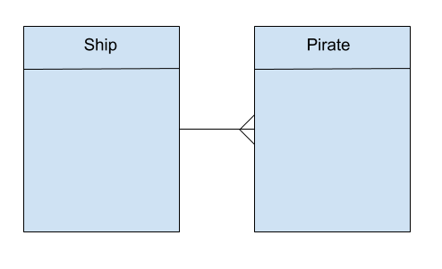
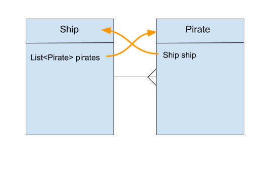
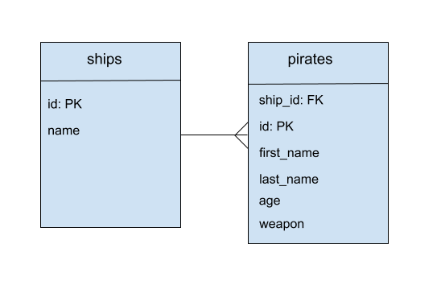
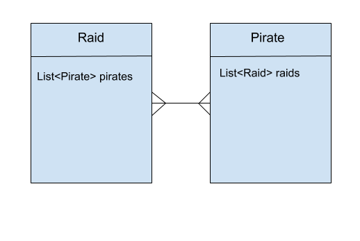
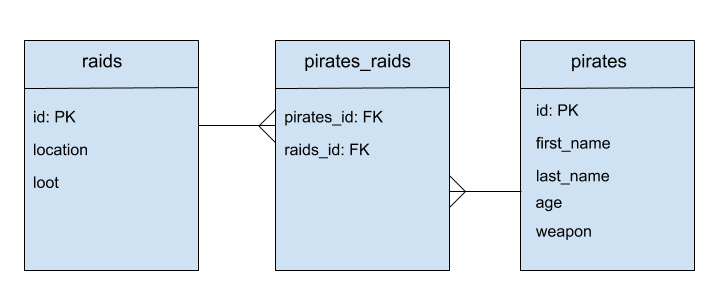

# Homework - Learn about Relationships

For this homework you will follow lessons on One To Many and Many to Many relationships with Spring and Hibernate.

We've provided the end code for you to follow along.

1. Follow along with the [Many to One Lesson](hw_one_to_many.md) and read the code along with it to help your understanding
2. Follow along with the [Many to Many Lesson](hw_many_to_many.md) and read the code provided to understand how it's implemented.

# One-To-Many Relationships using annotations

## Learning Objectives

- Understand the one-to-many relationship.
- Know how to map one-to-many relationships using hibernate annotations.

## Introduction

**Why are we learning this?** In Object Orientated programming it's extremely common to have objects that contain 
lists of other objects, or are related in some other way.

When saving these objects to the database, we want to save them in such a way that when the data is queried, 
the relationships are preserved, or that the relationships between objects actually help us query the data. For example:

- Give me all of the students for instructor Barbara
- Give me the students Barbara has who've done the weekend homework

Forgetting about databases for a moment, the above examples couldn't work if there was no relationship 
between the classes that represent the student and instructor objects.

We need to allow relationships to be saved to the database. There are three types of relationship:

- One-to-Many
- Many-to-Many
- One-to-One

This lesson will only focus on One-to-Many.

## Understanding the relationships

Extending on our pirate system, we now want to create a `Ship` class that will be persisted with a `ships` table 
that has the following properties:

* name - the name of the ship
* pirates - a `List` of `Pirate`

A ship will have a name and `List` of `Pirate`. To do this without databases entirely, that's all we would need. 
However to save that relationship in the database we need to do a little more. We need to know:

- the relationship between `Ship` and `Pirate` is **one-to-many**, that one `Ship` has many `Pirate`'s.
- the backwards relationship is **many-to-one**, that many `Pirate`s has one `Ship`.



**One ship has many pirates**

### Why map the opposite relationship?

With JPA + Hibernate, which we are going to use, this opposite relationship must also be realised and then mapped 
because queries from both sides need to work. For example, if we have a `Pirate` object and want to know its associated
`Ship`, that ship (or at least the ships ID) needs to be stored in `Pirate`.

In simple terms, a ship will have a list of `Pirate`s and a `Pirate` will have a single `Ship`. This single `Ship` in
`Pirate` simply "points back" to the `Ship`.

The following diagram shows very simple UML with the Ship containing a `List` of `Pirate` and the `Pirate` containing
one `Ship` with the relationships annotated in orange.



## Database Tables

Let's talk "database", putting the Java to one side for a moment. We know two tables are required: One called `ships` 
and one `pirates`. Remember it's a convention that table names use the plural.

### Foreign Keys

Relationships between tables in databases are made with **foreign keys**. A foreign key is a column in a table 
that contains the primary key of another table. Thus, the foreign key points to the primary key in another table, 
pointing to that table.



*Database Tables*

## Setting up the Relationships for JPA + Hibernate

We now completely understand the relationship we want to create in Java code, and have some understanding of 
what the resulting table structure needs to be. A quick summary so far will help with the next steps.

- One ship should have many pirates
- `Ship` should contain an ArrayList of `Pirate`s
- This is the **one-to-many** relationship
- Many pirates should have one ship
- `Pirate` should have a single associated `Ship` to "point back"
- This is the **many-to-one** relationship
- The `pirates` table has a foreign key `ship_id` pointing to the associated ship.

## Annotations

By using the above list as a guide, we now have enough information to correctly annotate the `Pirate` and `Ship` classes.

### One `Ship` should have many `Pirate`s

An annotation for this is provided by JPA `@OneToMany`. It should be used to annotate a `Collection`, `List` or
`ArrayList` property. In our case, we use it to annotate the `List` of `Pirate` in the `Ship` class. Like all Hibernate + JPA annotations, it can be either put directly on that property or the getter.

`@OneToMany` takes an argument `mappedBy` which needs to have the name of the property in `Pirate` class that we 
wish to use as the foreign key.

We will also use the fetch type `LAZY`. This means that when a ship is loaded from the database then the 
associated pirates should only be loaded on demand, or when it's asked for. The alternative here is that
when a ship is loaded, it loads all the pirates too, this is called EAGER `FetchType`. We may not want
**all** the pirates when loading a ship, so for now we use `FetchType.LAZY`. Looking into `Ship.java` we can see the list of `Pirate` annotated with `@OneToMany`.

```java
@OneToMany(mappedBy="ship")
private List<Pirate> pirates;
```
#### 'new' the List in constructor

When an instance of `Ship` is being created, the `List` of `Pirate` must also be instansiated, otherwise we will get a `null pointer exception`. This is when an object is being used that hasn't been instansiated or *"new'd"*.

Remember to `new` the list in the constructor of `Ship`

```java
this.pirates = new ArrayList<Pirate>();
```


#### Many `Pirate`s should have one `Ship`

An annotation for this is provided by JPA called `@ManyToOne`. It should be used to annotate the property in our class that **points back** to the class that stores many of it.

In our case we use it to annotate the `ship` property in `Pirate`. Since a `Pirate` needs to point back to its `Ship`. Also, because we need to tell JPA that we know `pirates` table needs to have a foreign key for `ships`.

```java
// ...

@ManyToOne // NEW
@JoinColumn(name="ship_id", nullable=false) // NEW
private Ship ship; // NEW
```

The `@ManyToOne` annotation is used to set the relationship between `Pirate` and `Ship` classes.

The `@JoinColumn` annotation will generate a column `ship_id` (a foreign key) in the pirates table which will point to the id of the `ships` table (primary key). JPA + Hibernate will take care of this for us. We only need to worry about the Java side which is why we don't give the `Pirate` class a `ship_id` property.

To ensure that each pirate needs to have a ship we will set the foreign key as `nullable = false`. So there must be an entry in that column. If we tried to save a pirate to the database without assigning them a ship then we would get a null pointer exception, for exmaple, `not-null property references a null or transient value : models.Pirate.ship`. We would also get an error if we save a pirate with a ship before we save the ship to the database as there would be no matching ship id.

So to ensure Pirate must have a ship we will also change the constructor of Pirate to take in the ship when we create a new Pirate object.

```java
// ...

@ManyToOne
@JoinColumn(name="ship_id", nullable=false)
private Ship ship;

public Pirate(String firstName, String lastName, int age, Ship ship) { // MODIFIED
this.firstName = firstName;
this.lastName = lastName;
this.age = age;
this.ship = ship; // NEW
}
```

### Set ship getter + setter


We've just added a new property `ship` to the `Pirate` class so it's important to not forget to add a getter and setter for that property.

```java
public Ship getShip() {
return ship;
}

public void setShip(Ship ship) {
this.ship = ship;
}
```

### Ship JpaRepository

In exactly the same way we done with `PirateRepository` we should create an interface `ShipRepository` that implements `JpaRepository`

```java

public interface ShipRepository extends JpaRepository<Ship, Long> {
}

```

### Creating Pirates and Ships

One we've updated `Pirate` and `Ship` it's now possible to setup both to save some data to the database.

```java
@Test
public void createPirateAndShip(){
Ship ship = new Ship("The Flying Dutchman");
shipRepository.save(ship);

Pirate pirate1 = new Pirate("Jack", "Sparrow", 32, ship);
pirateRepository.save(pirate1);
}
```

#### Output from psql
```
pirateservice=> select * from pirates;
id | age | first_name | last_name | ship_id
----+-----+------------+-----------+---------
1 |  32 | jack       | sparrow   |       1

```

## Checking the controller
Looking back at the `PirateController` we still have endpoint setup to get all pirates on `/pirates`.

Trying this endpoint now will result in some odd and likely non-deterministic behavior. Non-deterministic means it won't give a consistent results each time. In computing, non-determinisim is often bad, as inconsistency proves shows things are not working correctly.

To investigate this, look at the log output from Spring. We might see some errors like:

```
Cannot render error page for request [/pirates] and exception [Could not write JSON: Infinite recursion (StackOverflowError);
```

This means that for some reason, when the JSON is being created from our object, it's infinitely recursing becuase of some property.

Thinking about the relationship between `Pirate` and `Ship`. A `Ship` has a list of `Pirate`, and `Pirate` has a single `Ship` it's "in".

The serializer, which converts our objects to JSON is attempting the following:

1. Look at a ship
2. Go through all its properties and try to serialize them
3. If a relationship property is found, go to that relationship. So it finds `pirates` and goes into that object.
4. Look at that pirate
5. Go through all its properties and try to serialize them
6. If a relationship property is found, to to that relationship. So it finds `ship` and goes to that object.
7. Look at that ship
* ..
* .
* And so on repeating this pattern

This will happen without any issue for a long time in computing terms, until Java runs out of memory. This explains the "StackOverflowError".

### Fixing the recursive JSON StackOverflow

We now know that the problem is caused by the serializer which converts our object to JSON trying to serialize the properties of our model which have relationships.

This can be stopped simply by adding an annotation to these properties `@JsonIgnore`. This tells the serializer to not try and convert these properties to JSON.


In `Ship` we now have:

```java

@JsonIgnore             // NEW 
@OneToMany(mappedBy = "ship")
private List<Pirate> pirates;
```

The `/api/pirates` custom controller should now return correct data without trying to serialize the model relationships.

# Summary

- Should have some understanding the one-to-many relationship.
- Should have some idea how to map one-to-many relationships using hibernate annotations.


# Many-To-Many Relationships using Annotations

## # Learning Objectives

- Understand the many-to-many relationship.
- Know how to map many-to-many relationships using hibernate annotations.

## Introduction

**Why are we learning this?**
When saving objects to the database, we want to save them in such a way that when the data is queried, the relationships are preserved. Or that the relationships between objects actually help us query the data.

For example:

- Given a student "Jim", give me the classroom he's part of that has white walls
- Given classroom, give me all the students which use it that have brown hair

Without the many to many relationships, these queries of structured data wouldn't be possible. We need to allow relationships to be saved to the database. As mentioned before, there are three types.

This lesson will focus on Many-to-Many.

## Understanding the relationships

Extending our pirate system even further, we now want to add a `Raid` class that will be persisted with a `raids` table. This model should have properties:

* location - the name of a location where the raid takes place. Eg: Glasgow, Edinburgh, Tortuga, Tresure Island
* loot - the amount of plunder that was looted in that raid

A pirate can go on many different raids, and raids can have many different pirates go on them. A raid is simply a location that a group of pirates will visit together to "collect plunder" by whichever means they please.
Without the database mappings, this is just a case of having a `List` of `Pirate` in `Raid` and a `List` of `Raid` in `Pirate`. To save that relationship in the database we need to do a little more.

This requires the **many-to-many** relationship. A pirate can go on many raids, and a raid can have many pirates:



*Many to Many Relationship*

We need to understand that with many-to-many, the relationship is relatively symmetrical. It's also important to know that each side still has to be mapped for JPA + Hibernate to setup the relationship correctly.

### Why do both sides need to be mapped?

With JPA + Hibernate which we are going to use, both sides of the relationship need to be mapped because we want to be able to make queries from both sides. For example if we have a `Raid` object and want to know which `Pirate`s went on that raid, then the mapping must exist from the `Raid` side. The same applies for the opposite. For example if we have a `Pirate` and want to know which `Raid`'s that pirate went on, we need to have the mapping on that side.

## Database Tables

Taking about the database side and putting the Java to one side for a moment. We know two tables are required. One called `pirates` and one `raids`.

### Foreign Keys in a Join Table

Many-to-many relationships between two tables in databases are made by creating a join table that sits between the two tables. The join table has two columns for foreign keys. One with the foreign key of one side (our `pirates` foreign key) and the other with foreign key of the other side of our relationship (the `raids` foreign key). The columns are simply named `pirate_id` and `raid_id`, respectively.

Each row of the join table maps one side of the relationship to the other and each mapping can exist many times for either side. An example of populated tables including join table for our `pirates` + `raids` might look like this:

**raids**

| id | location | loot |
|----|----------|------|
|  1 | Tortuga  |  100 |
|  2 | Tortuga  |  100 |
|  3 | Tortuga  |  100 |
|  4 | Tortuga  |  100 |

**pirates_raids** (join table)

| Pirate ID | Raid ID |
| --------- | ------- |
| 1         | 3       |
| 1         | 4       |
| 1         | 2       |
| 2         | 1       |

**pirates**

id | age | first_name | last_name | ship_id
----|-----|------------|-----------|---------
1 |  32 | jack       | sparrow   |       1
2 |  40 | jimmy      | nail      |       2

- Pirate with id `1` has raids `3`, `4` and `2`
- Pirate with id  `2` has raid `1`
- Raid with id `3` has pirate `1`

Our table diagram now looks like this.



*Database table diagram with relationships*

## Setting up the Relationships for JPA + Hibernate

We now understand the relationship we want to create in Java code and have some understand of what the resulting table structure needs to be. A quick summary so far will help with the next steps:

- Pirate should have many raids
- `Pirate` should contain a list of `Raid`
- `Pirate` should have something that sets up one side of the join table `pirates_raids`
- Raid should have many pirates
- `Raid` should contain a list of `Pirate`
- `Raid` should have something that sets up the other side of the join table `pirates_raids`

**Remember** when adding lists they need to be instansiated in the constructor.

## Annotations

By using the above steps as a guide, we now have enough information to correctly annotate `Raid` and `Pirate` classes.

### Many `Pirate`s should have many `Raid`s

An annotation for this is provided by JPA `@ManyToMany`. It should be used to annotate properties of a class or the properties getters. Typically these properties are of type `Collection`, `List` or `ArrayList`.

### JoinTable and JoinColumn

`@JoinTable` is required to setup the join table. We must instruct JPA about the join table we wish to have created for us, as well as which columns to setup within that join table. To indicate which columns we want in the join table, a `@JoinColumn` must be passed into the `@JoinTable` via the `joinColumn` argument. We must give that the name of the columns we wish to setup in the join table **from the point of view of the class or table we are "in"**.

So in `Pirate` we will give the `JoinTable` a `JoinColumn` with name `pirate_id`.

```java
@ManyToMany
@JoinTable(
name = "pirates_raids",
joinColumns = { @JoinColumn(
name = "pirate_id",
nullable = false,
updatable = false)
}
)
```

We must also map the reverse with the `inverseJoinColumns` argument to `@JoinTable`. Remember this is from the point of view of the class we are "in", so for `Pirate` this would be `raid_id`.

```java
@JsonIgnore
@ManyToMany
@JoinTable(
name = "pirates_raids",
joinColumns = { @JoinColumn(
name = "pirate_id",
nullable = false,
updatable = false)
},
inverseJoinColumns = { @JoinColumn(
name = "raid_id",
nullable = false,
updatable = false)
}
)
```

We don't want these columns in the join table to be allowed to be set to null. Also, it's not desired that they should be able to be individually updated. This is because allowing the join tables rows to be set individually will break relationships that exist. This is not to say the relationships should never be removed, it just means they cannot be individually changed once created.

### Many `Raid`s should have many `Pirate`s

For the other side of this relationship, we use exactly the same annotations with the same rules:

- `@ManyToMany`
- `@JoinTable` with
- name of join table
-  `joinColumns` containing a `@JoinColumn` with the name of the column we wish to map the foreign key for from that class.
- `inverseJoinColumns` containing a `@JoinColumn` with the name of the column we wish to map to the foreign key for the **other** class.

```java
@JsonIgnore 
@ManyToMany
@JoinTable(
name = "pirate_raid",
joinColumns = { @JoinColumn(
name = "raid_id",
nullable = false,
updatable = false)
},
inverseJoinColumns = { @JoinColumn(
name = "pirate_id",
nullable = false,
updatable = false)
})
private List<Pirate> pirates;

```
Note: remember to add the `@JsonIgnore` annotation to instruct the serializer to not serialize the relationship properties. This should be done on both sides of the many-to-many.

## Cascade Types and Cascading

When we make a change to one side of the many to many, we can choose what happens to the other side. Thus, if we delete one side, we can use the `@Cascade` setting to allow or disallow the delete action. These settings are filters for the cascade actions we wish to allow. If for example we set it to `SAVE_UPDATE` then only save and update actions are cascaded to the other side of the relationship.

## Classes Methods for Adding to the Lists

Before trying it, make sure there's class methods for adding `Pirate` objects to the list in `Raid` and adding `Raid` objects to the list in `Pirate`, otherwise there's no way to setup the relationships.

## `JpaRepository`

A `JpaRepository` will need to be used for each model to persist that model to the database.

It should now be possible to add pirates to raids and raids to pirates, save these with the repository and check the `psql` database for the relationship. To check it, simply query for all rows of the join table `pirates_raids`.


# Summary

- Should understand the many-to-many relationship.
- Should know how to map many-to-many relationships using JPA + Hibernate annotations.
